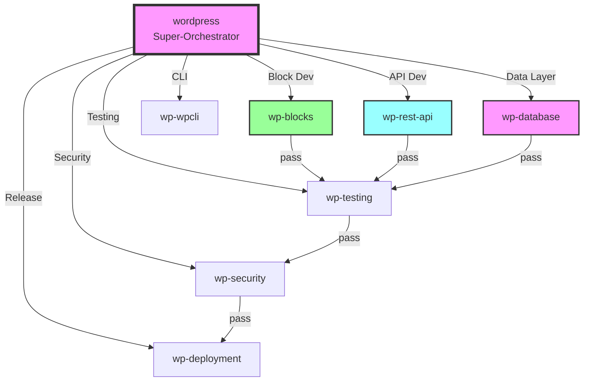
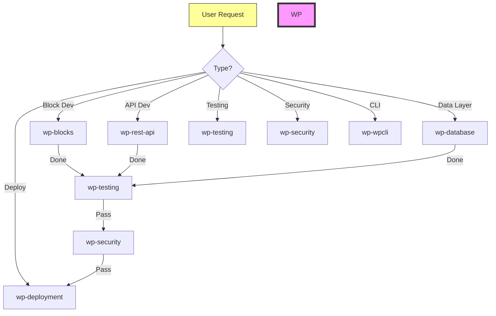
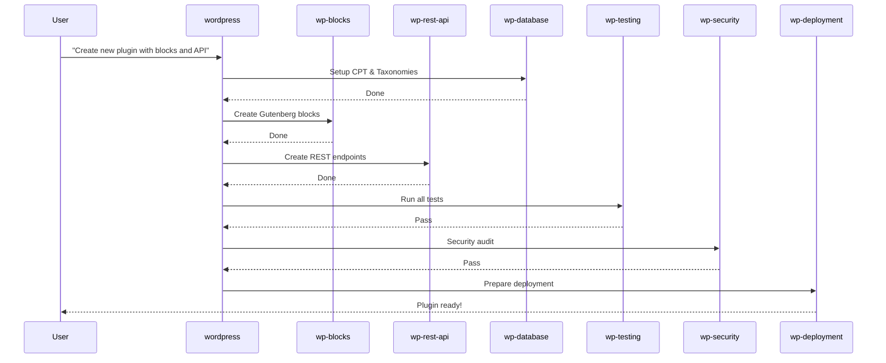
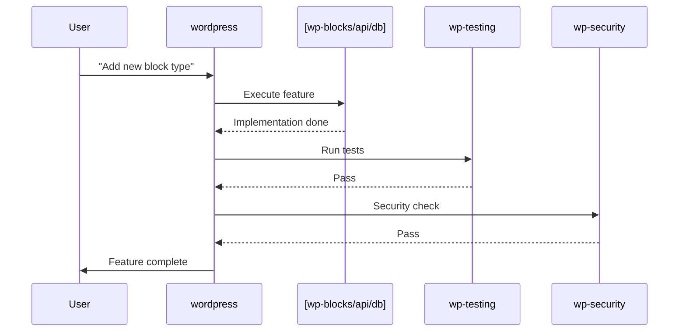
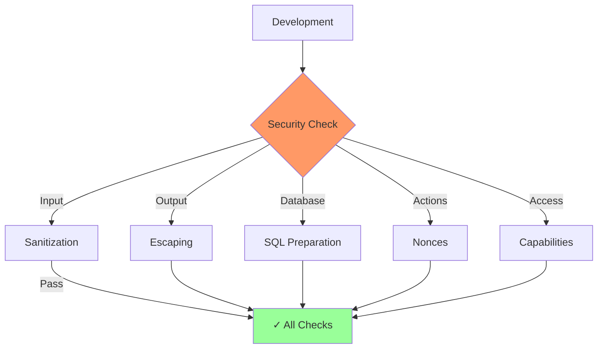
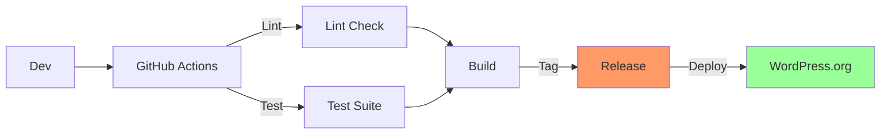

# Ultimate WordPress Development Skill System

## Purpose

The WordPress skill is the **super-orchestrator** for all WordPress development tasks. It coordinates specialized sub-skills for different aspects of WordPress plugin development with React + TypeScript.

## Trigger

- **Manual:** `/wordpress` or "WordPress" or "WP development"
- **From main-menu:** When user selects WordPress tasks
- **Auto:** When detecting WordPress plugin files (plugin.php, block.json, composer.json)

---

## Core Sub-Skills

| Sub-Skill | Command | Description | Priority |
|-----------|---------|-------------|----------|
| **wp-blocks** | `/wp-blocks` | Gutenberg Block Development | **High** |
| **wp-rest-api** | `/wp-rest-api` | REST API CRUD Operations | **High** |
| **wp-database** | `/wp-database` | CPT, Taxonomies, Meta | **High** |
| **wp-testing** | `/wp-testing` | PHPUnit & Jest Testing | **High** |
| **wp-security** | `/wp-security` | Security Hardening | **High** |
| **wp-deployment** | `/wp-deployment` | WordPress.org & CI/CD | **Medium** |
| **wp-wpcli** | `/wp-wpcli` | WP-CLI Commands | **Medium** |

---

## Architecture



---

## Step 1: Analyze Request

### Determine Workflow Type

Based on user input, determine which sub-skill to call:

| Input Pattern | Primary Sub-Skill | Secondary Skills |
|--------------|-------------------|------------------|
| "Block" or "Gutenberg" or "Block Editor" | wp-blocks | → wp-testing → wp-security |
| "REST API" or "Endpoint" or "API" | wp-rest-api | → wp-testing → wp-security |
| "CPT" or "Taxonomy" or "Custom Post" | wp-database | → wp-testing → wp-security |
| "Test" or "PHPUnit" or "Jest" | wp-testing | - |
| "Security" or "Hardening" or "Secure" | wp-security | - |
| "Deploy" or "Release" or "WordPress.org" | wp-deployment | - |
| "WP-CLI" or "Command" | wp-wpcli | - |

### Mermaid: Decision Tree



---

## Step 2: Plugin Project Setup

### Standard Plugin Structure

```bash
my-plugin/
├── composer.json                  # PSR-4 autoloading
├── phpunit.xml                    # Test configuration
├── package.json                   # Node dependencies
├── tsconfig.json                  # TypeScript config
├── webpack.config.js              # Build config (or vite.config.ts)
├── my-plugin.php                  # Plugin header
├── readme.txt                     # WordPress.org readme
├── bin/                          # CLI scripts
├── src/
│   ├── Plugin.php                # Main plugin class
│   ├── Blocks/                   # Gutenberg blocks
│   ├── Rest/                     # REST API endpoints
│   ├── Database/                 # CPT, Taxonomies
│   ├── CLI/                      # WP-CLI commands
│   └── Utils/                    # Helper classes
├── resources/
│   ├── assets/                   # JS/TS source
│   └── views/                    # PHP templates
├── build/                        # Compiled assets
├── tests/                        # PHPUnit tests
└── languages/                   # Translation files
```

### Composer Configuration (PSR-4)

```json
{
    "name": "myvendor/my-plugin",
    "description": "My WordPress Plugin",
    "type": "wordpress-plugin",
    "autoload": {
        "psr-4": {
            "MyVendor\\MyPlugin\\": "src/"
        }
    },
    "require": {
        "php": ">=7.4"
    },
    "require-dev": {
        "phpunit/phpunit": "^9.5",
        "wp-coding-standards/wpcs": "^3.0"
    }
}
```

---

## Step 3: Development Workflow

### A) New Plugin Development



### B) Feature Implementation



---

## Step 4: Sub-Skill Selection

### Quick Reference

```
┌─────────────────────────────────────────────────────────────┐
│                    WORDPRESS DEVELOPMENT                    │
├─────────────────────────────────────────────────────────────┤
│  BLOCKS                                                     │
│     /wp-blocks create [name]  → Create new block           │
│     /wp-blocks pattern        → Create block pattern        │
│     /wp-blocks variation      → Create block variation      │
│     /wp-blocks binding       → Create block binding        │
│                                                             │
│  REST API                                                   │
│     /wp-rest-api create [name] → Create REST endpoint      │
│     /wp-rest-api crud         → CRUD operations            │
│     /wp-rest-api auth         → Authentication setup       │
│                                                             │
│  DATABASE                                                   │
│     /wp-database cpt [name]   → Create CPT                  │
│     /wp-database taxonomy     → Create taxonomy            │
│     /wp-database meta         → Add meta fields             │
│                                                             │
│  TESTING                                                    │
│     /wp-testing phpunit        → Run PHPUnit tests          │
│     /wp-testing jest          → Run Jest tests             │
│     /wp-testing coverage      → Generate coverage         │
│                                                             │
│  SECURITY                                                   │
│     /wp-security audit        → Security audit             │
│     /wp-security nonce         → Check nonce handling       │
│     /wp-security capability   → Check capabilities        │
│                                                             │
│  DEPLOYMENT                                                 │
│     /wp-deployment svn       → Deploy to WordPress.org    │
│     /wp-deployment github     → Setup GitHub Actions      │
│     /wp-deployment version    → Version bump              │
└─────────────────────────────────────────────────────────────┘
```

---

## Step 5: Common Patterns

### Plugin Bootstrap (PSR-4)

```php
<?php
/**
 * Plugin Name: My Ultimate Plugin
 * Description: A comprehensive WordPress plugin
 * Version: 1.0.0
 * Author: Developer
 * Text Domain: my-plugin
 */

namespace MyVendor\MyPlugin;

if ( ! defined( 'ABSPATH' ) ) {
    exit;
}

require_once __DIR__ . '/vendor/autoload.php';

final class Plugin {
    private static $instance = null;

    public static function instance(): self {
        if ( null === self::$instance ) {
            self::$instance = new self();
        }
        return self::$instance;
    }

    private function __construct() {
        add_action( 'init', [ $this, 'init' ] );
    }

    public function init() {
        $this->load_textdomain();
        $this->register_blocks();
        $this->register_rest_api();
    }

    private function load_textdomain() {
        load_plugin_textdomain( 'my-plugin', false, dirname( plugin_basename( __FILE__ ) ) . '/languages' );
    }

    private function register_blocks() {
        // Register Gutenberg blocks
    }

    private function register_rest_api() {
        // Register REST endpoints
    }
}

Plugin::instance();
```

### Activation/Deactivation

```php
register_activation_hook( __FILE__, function() {
    // Flush rewrite rules for CPTs
    // Create database tables
    // Set default options
} );

register_deactivation_hook( __FILE__, function() {
    // Clear transients
    // Flush rewrite rules
    // Optionally: delete data
} );

register_uninstall_hook( __FILE__, 'plugin_uninstall' );

function plugin_uninstall() {
    // Clean up all plugin data
    delete_option( 'my_plugin_options' );
    // Delete custom tables
    // Clean up posts/meta
}
```

---

## Step 6: Security Workflow

### Security Checklist



### Security Implementation

```php
// Nonces
$nonce = wp_create_nonce( 'my_plugin_action' );
wp_verify_nonce( $_POST[ '_wpnonce' ], 'my_plugin_action' );

// Capabilities
if ( ! current_user_can( 'manage_options' ) ) {
    wp_die( __( 'Unauthorized', 'my-plugin' ) );
}

// Sanitization
$input = sanitize_text_field( $_POST[ 'input' ] );
$email = sanitize_email( $_POST[ 'email' ] );
$url = esc_url( $url );

// SQL Preparation
$wpdb->prepare( 
    "SELECT * FROM {$wpdb->posts} WHERE ID = %d",
    absint( $post_id )
);

// Output Escaping
echo esc_html( $text );
echo esc_attr( $attribute );
echo esc_url( $url );
```

---

## Step 7: Testing Workflow

### Testing Stack

| Test Type | Tool | Coverage |
|-----------|------|----------|
| PHP Unit | PHPUnit | 100% of PHP code |
| JavaScript | Jest | Critical paths |
| Integration | PHPUnit + WP_UnitTestCase | Plugin integration |
| E2E | Playwright | Critical user flows |

### Run Tests

```bash
# PHP tests
composer test
./vendor/bin/phpunit

# JS tests
npm test

# Linting
composer lint
npm run lint

# Full test suite
npm run test:all
```

---

## Step 8: Deployment Workflow

### Version Management



### GitHub Actions Workflow

```yaml
name: Deploy to WordPress.org
on:
  push:
    tags:
      - '*'
jobs:
  deploy:
    runs-on: ubuntu-latest
    steps:
      - uses: actions/checkout@v4
      - uses: actions/setup-php@v2
        with:
          php-version: '8.0'
      - run: composer install
      - run: npm install
      - run: npm run build
      - run: ./vendor/bin/phpunit
      - uses: 10up/action-wordpress-plugin-deploy@stable
        with:
          svn-url: ${{ secrets.SVN_URL }}
        env:
          SVN_USERNAME: ${{ secrets.SVN_USERNAME }}
```

---

## Step 9: Error Handling

### Common WordPress Errors

| Error | Cause | Solution |
|-------|-------|----------|
| "Plugin activated but missing file" | Composer autoload not loaded | Run composer dump-autoload |
| "404 on REST endpoint" | rewrite rules not flushed | flush_rewrite_rules() |
| "Block type not found" | block.json path mismatch | Check registration |
| "Nonce verification failed" | Missing or wrong nonce | Add wp_create_nonce |
| "Capability check failed" | Wrong capability | Use correct capability |
| "SQL injection warning" | Raw query | Use $wpdb->prepare |

---

## Commands

| Command | Description |
|---------|-------------|
| `/wordpress` | Start WordPress development workflow |
| `/wordpress status` | Show current project state |
| `/wordpress blocks` | Jump to wp-blocks |
| `/wordpress api` | Jump to wp-rest-api |
| `/wordpress database` | Jump to wp-database |
| `/wordpress test` | Jump to wp-testing |
| `/wordpress security` | Jump to wp-security |
| `/wordpress deploy` | Jump to wp-deployment |

---

## Output Format

### Project Status Report

```markdown
## WordPress Development Status

### Current Project: My Plugin

| Component | Status | Next Action |
|-----------|--------|-------------|
| Database (CPTs) | ✅ Complete | - |
| REST API | ✅ Complete | Run tests |
| Gutenberg Blocks | 🔄 In Progress | Add variations |
| Testing | ⏳ Pending | Run after blocks |
| Security | ⏳ Pending | After testing |
| Deployment | ⏳ Pending | After security |

### Sub-Skills Usage
- wp-blocks: 3 blocks created
- wp-rest-api: 5 endpoints
- wp-database: 2 CPTs, 1 taxonomy

### Next Recommended Action
1. Add block variations (wp-blocks)
2. Run tests (wp-testing)
3. Security audit (wp-security)

[Continue Development] [View Details] [Switch Component]
```

---

## Integration

### Called By

| Skill | When |
|-------|------|
| main-menu | User selects WordPress tasks |
| (direct) | User invokes /wordpress |

### Calls

| Sub-Skill | Trigger |
|-----------|---------|
| wp-blocks | Block development request |
| wp-rest-api | REST API development request |
| wp-database | Database/CPT development request |
| wp-testing | After any implementation |
| wp-security | After testing pass |
| wp-deployment | After security pass |

---

## References

### Official Documentation

- [WordPress Developer Documentation](https://developer.wordpress.org/)
- [Plugin Handbook](https://developer.wordpress.org/plugins/)
- [REST API Handbook](https://developer.wordpress.org/rest-api/)
- [Block Editor Handbook](https://developer.wordpress.org/block-editor/)
- [WordPress Coding Standards](https://developer.wordpress.org/coding-standards/wordpress-coding-standards/)

### Best Practices

1. **Always use PSR-4** autoloading for scalable plugins
2. **Prefer dynamic blocks** for server-rendered content
3. **Implement full testing** (PHPUnit + Jest)
4. **Security first** - nonce, capability, sanitize, escape
5. **Use WordPress APIs** - don't reinvent the wheel
6. **Follow coding standards** - WPCS, ESLint
7. **Document everything** - inline docs, readme.txt

---

## Version

**Version:** 1.0.0  
**Last Updated:** 2026-03-24  
**Author:** zenclaw