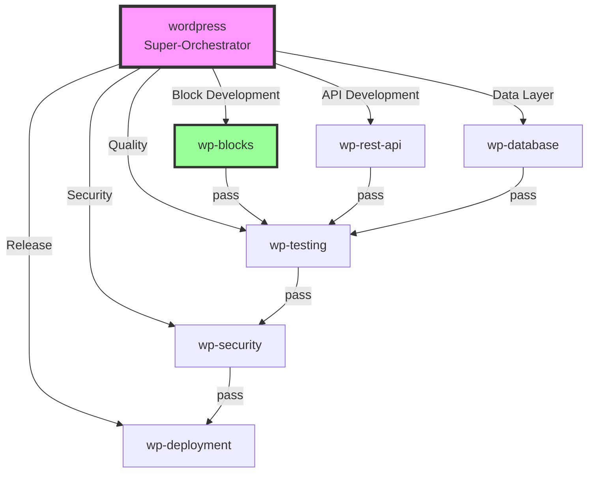
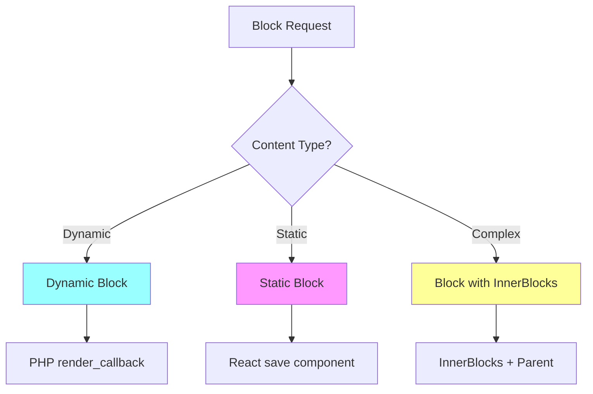

# wp-blocks: Ultimate Gutenberg Block Development Skill

## Purpose

This skill provides comprehensive guidance for developing WordPress Gutenberg blocks with React + TypeScript. It covers all aspects from basic block registration to advanced features like block variations, patterns, block bindings, and Full Site Editing.

## Trigger

- **Manual:** `/wp-blocks` or "Block entwickeln" or "create block" or "Gutenberg block"
- **From wordpress super-skill:** When user requests block development
- **Auto:** When detecting block-related files (block.json, index.ts, edit.tsx, save.tsx)

---

## Position in WordPress Skill System



---

## Core Responsibilities

| Responsibility | Description |
|----------------|-------------|
| **Block Registration** | Register blocks via block.json and PHP |
| **Block Types** | Create dynamic and static blocks |
| **Block Components** | Edit, Save, Inspector, InnerBlocks |
| **Block Variations** | Define block variations for user choice |
| **Block Patterns** | Create reusable block patterns |
| **Block Bindings** | Connect blocks to custom sources |
| **Full Site Editing** | Support block themes and site editing |
| **Block Styling** | theme.json, CSS variables, block styles |

---

## Step 1: Analyze Request

### Determine Block Type

Based on user input, determine which type of block to create:

| Input Pattern | Block Type | Use Case |
|--------------|------------|----------|
| "dynamic block" | Dynamic Block | Server-rendered content, PHP-based |
| "static block" | Static Block | Client-side only, React components |
| "pattern" | Block Pattern | Pre-built layouts |
| "variation" | Block Variation | Different configurations |
| "binding" | Block Binding | Connect to external data |
| "inner blocks" | InnerBlocks | Nested block structures |
| "site editor" | Block Theme | Full Site Editing |

### Block Architecture Decision



---

## Step 2: Block Project Setup

### Recommended Directory Structure

```bash
my-plugin/
├── src/
│   └── blocks/
│       └── my-block/
│           ├── index.ts              # Block registration
│           ├── block.json             # Block metadata
│           ├── edit.tsx              # Editor component
│           ├── save.tsx              # Frontend component
│           ├── edit.tsx              # Inspector controls
│           ├── transforms.ts         # Block transforms
│           ├── variations.ts         # Block variations
│           ├── style.css             # Frontend styles
│           ├── editor.css             # Editor styles
│           └── variations/           # Variation files
├── build/                            # Compiled assets
└── includes/
    └── class-my-blocks.php           # PHP registration
```

### Package.json Configuration

```json
{
  "name": "my-plugin-blocks",
  "version": "1.0.0",
  "scripts": {
    "start": "wp-scripts start",
    "build": "wp-scripts build",
    "lint:js": "wp-scripts lint-js",
    "lint:css": "wp-scripts lint-css",
    "format": "wp-scripts format",
    "test:unit": "wp-scripts test-unit-js"
  },
  "devDependencies": {
    "@wordpress/scripts": "^27.0.0",
    "@wordpress/components": "^27.0.0",
    "@wordpress/element": "^27.0.0",
    "@wordpress/blocks": "^27.0.0",
    "@wordpress/i18n": "^27.0.0",
    "@wordpress/icons": "^27.0.0"
  }
}
```

### tsconfig.json

```json
{
  "extends": "@wordpress/scripts/tsconfig.json",
  "compilerOptions": {
    "lib": ["ES2020", "DOM", "DOM.Iterable"],
    "moduleResolution": "node",
    "target": "ES2020",
    "strict": true,
    "jsx": "react-jsx",
    "noEmitOnError": true,
    "isolatedModules": true,
    "allowSyntheticDefaultImports": true,
    "esModuleInterop": true
  },
  "include": ["src/**/*", "types/**/*"]
}
```

---

## Step 3: Block Registration

### A) Dynamic Block (PHP Registration)

#### 1. Block.json (Required)

```json
{
  "$schema": "https://schemas.wp.org/trunk/block.json",
  "apiVersion": 3,
  "name": "my-plugin/my-dynamic-block",
  "version": "1.0.0",
  "title": "My Dynamic Block",
  "category": "text",
  "icon": "editor-paragraph",
  "description": "A dynamic block that renders on the server",
  "keywords": ["example", "dynamic"],
  "supports": {
    "align": true,
    "html": false,
    "customClassName": true,
    "anchor": true
  },
  "attributes": {
    "content": {
      "type": "string",
      "default": ""
    },
    "alignment": {
      "type": "string",
      "default": "left"
    }
  },
  "textdomain": "my-plugin",
  "editorScript": "file:./build/index.js",
  "editorStyle": "file:./build/index.css",
  "style": "file:./build/style-index.css"
}
```

#### 2. PHP Registration (Plugin)

```php
<?php
/**
 * Plugin Name: My Dynamic Blocks
 * Description: Dynamic Gutenberg blocks
 * Version: 1.0.0
 */

function register_my_dynamic_blocks() {
    $asset_file = include( plugin_dir_path( __FILE__ ) . 'build/index.asset.php' );

    wp_register_script(
        'my-dynamic-blocks-editor',
        plugins_url( 'build/index.js', __FILE__ ),
        $asset_file['dependencies'],
        $asset_file['version']
    );

    wp_register_style(
        'my-dynamic-blocks-editor',
        plugins_url( 'build/index.css', __FILE__ ),
        array(),
        $asset_file['version']
    );

    wp_register_style(
        'my-dynamic-blocks-style',
        plugins_url( 'build/style-index.css', __FILE__ ),
        array(),
        $asset_file['version']
    );

    register_block_type( 'my-plugin/my-dynamic-block', array(
        'editor_script' => 'my-dynamic-blocks-editor',
        'editor_style' => 'my-dynamic-blocks-editor',
        'style' => 'my-dynamic-blocks-style',
        'render_callback' => 'render_my_dynamic_block',
    ) );
}
add_action( 'init', 'register_my_dynamic_blocks' );

function render_my_dynamic_block( $attributes, $content ) {
    $content = isset( $attributes['content'] ) ? $attributes['content'] : '';
    $alignment = isset( $attributes['alignment'] ) ? $attributes['alignment'] : 'left';

    return sprintf(
        '<div class="wp-block-my-dynamic-block" style="text-align: %s">
            <p>%s</p>
        </div>',
        esc_attr( $alignment ),
        esc_html( $content )
    );
}
```

### B) Static Block (JS Registration)

#### 1. block.json

```json
{
  "$schema": "https://schemas.wp.org/trunk/block.json",
  "apiVersion": 3,
  "name": "my-plugin/my-static-block",
  "title": "My Static Block",
  "category": "design",
  "icon": "columns",
  "description": "A static React-based block",
  "supports": {
    "align": ["wide", "full"],
    "html": false,
    "color": {
      "background": true,
      "text": true,
      "gradients": true
    },
    "spacing": {
      "margin": true,
      "padding": true
    }
  },
  "attributes": {
    "title": {
      "type": "string",
      "default": ""
    },
    "backgroundColor": {
      "type": "string"
    },
    "textColor": {
      "type": "string"
    }
  },
  "editorScript": "file:./build/index.js"
}
```

#### 2. JavaScript Registration (index.ts)

```typescript
import { registerBlockType } from '@wordpress/blocks';
import Edit from './edit';
import Save from './save';
import metadata from './block.json';

registerBlockType( metadata.name, {
    edit: Edit,
    save: Save,
    deprecated: [
        {
            attributes: {
                oldAttr: { type: 'string' }
            },
            migrate( attributes ) {
                return { newAttr: attributes.oldAttr };
            },
            save( props ) {
                return <div>{ props.attributes.oldAttr }</div>;
            }
        }
    ]
} );
```

---

## Step 4: Block Components

### A) Edit Component (Editor)

```tsx
import { 
    useBlockProps, 
    InspectorControls,
    BlockAlignmentToolbar,
    BlockControls 
} from '@wordpress/block-editor';
import { 
    PanelBody, 
    TextControl, 
    ToggleControl,
    SelectControl,
    ColorPalette,
    RangeControl
} from '@wordpress/components';
import { __ } from '@wordpress/i18n';

interface BlockEditProps {
    attributes: {
        content: string;
        alignment: string;
        showImage: boolean;
        imageSize: string;
        backgroundColor: string;
    };
    setAttributes: ( attrs: Partial< BlockEditProps[ 'attributes' ] > ) => void;
    isSelected: boolean;
}

export default function Edit( { attributes, setAttributes, isSelected }: BlockEditProps ) {
    const blockProps = useBlockProps( {
        className: `align-${ attributes.alignment }`
    } );

    const onContentChange = ( newContent: string ) => {
        setAttributes( { content: newContent } );
    };

    return (
        <>
            <InspectorControls>
                <PanelBody title={ __( 'Block Settings', 'my-plugin' ) }>
                    <SelectControl
                        label={ __( 'Alignment', 'my-plugin' ) }
                        value={ attributes.alignment }
                        options={ [
                            { label: __( 'Left', 'my-plugin' ), value: 'left' },
                            { label: __( 'Center', 'my-plugin' ), value: 'center' },
                            { label: __( 'Right', 'my-plugin' ), value: 'right' },
                        ] }
                        onChange={ ( value ) => setAttributes( { alignment: value } ) }
                    />
                    <ToggleControl
                        label={ __( 'Show Image', 'my-plugin' ) }
                        checked={ attributes.showImage }
                        onChange={ ( value ) => setAttributes( { showImage: value } ) }
                    />
                    { attributes.showImage && (
                        <SelectControl
                            label={ __( 'Image Size', 'my-plugin' ) }
                            value={ attributes.imageSize }
                            options={ [
                                { label: 'Small', value: 'small' },
                                { label: 'Medium', value: 'medium' },
                                { label: 'Large', value: 'large' },
                            ] }
                            onChange={ ( value ) => setAttributes( { imageSize: value } ) }
                        />
                    ) }
                    <RangeControl
                        label={ __( 'Content Length', 'my-plugin' ) }
                        value={ attributes.content.length }
                        min={ 0 }
                        max={ 500 }
                        onChange={ () => {} }
                    />
                </PanelBody>
                <PanelBody title={ __( 'Colors', 'my-plugin' ) }>
                    <ColorPalette
                        label={ __( 'Background Color', 'my-plugin' ) }
                        colors={ [
                            { color: '#f1f1f1', name: 'Gray' },
                            { color: '#000000', name: 'Black' },
                            { color: '#ffffff', name: 'White' },
                        ] }
                        value={ attributes.backgroundColor }
                        onChange={ ( color ) => setAttributes( { backgroundColor: color } ) }
                    />
                </PanelBody>
            </InspectorControls>

            <div { ...blockProps }>
                <TextControl
                    label={ __( 'Content', 'my-plugin' ) }
                    value={ attributes.content }
                    onChange={ onContentChange }
                    placeholder={ __( 'Enter your content here...', 'my-plugin' ) }
                />
                { isSelected && (
                    <p className="editor-notice">
                        { __( 'Click to edit this block', 'my-plugin' ) }
                    </p>
                )}
            </div>
        </>
    );
}
```

### B) Save Component (Frontend)

```tsx
import { useBlockProps } from '@wordpress/block-editor';

interface BlockSaveProps {
    attributes: {
        content: string;
        alignment: string;
        showImage: boolean;
        imageSize: string;
    };
}

export default function Save( { attributes }: BlockSaveProps ) {
    const blockProps = useBlockProps.save( {
        className: `align-${ attributes.alignment }`
    } );

    return (
        <div { ...blockProps }>
            { attributes.showImage && (
                
            ) }
            <div className="block-content">
                { attributes.content }
            </div>
        </div>
    );
}
```

---

## Step 5: Block Variations

### Creating Block Variations

```typescript
import { registerBlockVariation } from '@wordpress/blocks';
import { __ } from '@wordpress/i18n';

registerBlockVariation( 'core/image', {
    name: 'image-with-caption',
    title: __( 'Image with Caption', 'my-plugin' ),
    description: __( 'An image with a caption below', 'my-plugin' ),
    icon: 'format-image',
    isActive: ( { size, caption } ) => size && caption,
    attributes: {
        align: 'wide',
        sizeSlug: 'large'
    },
    innerBlocks: [
        [ 'core/image', { sizeSlug: 'large' } ],
        [ 'core/caption', { placeholder: __( 'Write caption...' ) } ]
    ],
    scope: [ 'inserter', 'transform' ]
} );
```

### Variation Types

```typescript
// Multiple variations with switcher
registerBlockVariation( 'my-plugin/hero', [
    {
        name: 'hero-small',
        title: __( 'Small Hero', 'my-plugin' ),
        attributes: { height: 'small' }
    },
    {
        name: 'hero-medium',
        title: __( 'Medium Hero', 'my-plugin' ),
        attributes: { height: 'medium' }
    },
    {
        name: 'hero-large',
        title: __( 'Large Hero', 'my-plugin' ),
        attributes: { height: 'large' }
    }
] );
```

---

## Step 6: Block Patterns

### Registering Block Patterns

```typescript
import { registerBlockPattern } from '@wordpress/blocks';

registerBlockPattern( 'my-plugin/hero-section', {
    title: __( 'Hero Section', 'my-plugin' ),
    description: __( 'A full-width hero with heading and CTA', 'my-plugin' ),
    categories: [ 'hero', 'banner' ],
    keywords: [ 'hero', 'banner', 'header' ],
    content: `
        <!-- wp:cover {"minHeight":600,"align":"full"} -->
        <div class="wp-block-cover alignfull" style="min-height:600px">
            <span class="wp-block-cover__background"></span>
            <div class="wp-block-cover__inner-container">
                <!-- wp:heading {"textAlign":"center","level":1} -->
                <h1 class="has-text-align-center">Welcome</h1>
                <!-- /wp:heading -->
                <!-- wp:paragraph {"align":"center"} -->
                <p class="has-text-align-center">Your amazing tagline here</p>
                <!-- /wp:paragraph -->
                <!-- wp:buttons {"layout":{"type":"flex","justifyContent":"center"}} -->
                <div class="wp-block-buttons">
                    <!-- wp:button -->
                    <div class="wp-block-button">
                        <a class="wp-block-button__link">Get Started</a>
                    </div>
                    <!-- /wp:button -->
                </div>
                <!-- /wp:buttons -->
            </div>
        </div>
        <!-- /wp:cover -->
    `
} );
```

### Pattern Categories

```typescript
registerBlockPatternCategory( 'hero', {
    label: 'Hero Sections',
    description: 'Full-width header sections'
} );
```

---

## Step 7: Block Bindings

### Register Custom Block Binding Source

```typescript
import { registerBlockBindingSource } from '@wordpress/blocks';

registerBlockBindingSource( 'my-plugin/post-data', {
    label: 'Post Data',
    getValue: function( { context }: { context: Record<string, unknown> } ) {
        if ( ! context.postType || ! context.postId ) {
            return undefined;
        }
        
        // Fetch post data via API
        return wp.apiFetch( {
            path: `/wp/v2/${ context.postType }/${ context.postId }`
        } ).then( ( post ) => ( {
            title: post.title.rendered,
            date: post.date,
            author: post._embedded?.author?.[ 0 ]?.name
        } ) );
    }
} );
```

### Using Block Bindings in Edit Component

```tsx
export default function Edit( { attributes }: BlockEditProps ) {
    const blockProps = useBlockProps();
    
    const boundValue = useSelect( ( select ) => {
        return select( 'core/block-editor' ).getBlockAttributes( 
            attributes?.boundAttribute 
        );
    }, [ attributes?.boundAttribute ] );

    return (
        <div { ...blockProps }>
            <RichText
                value={ boundValue?.title || '' }
                onChange={ () => {} }
                placeholder={ __( 'Bound to post title', 'my-plugin' ) }
                boundAttribute="title"
            />
        </div>
    );
}
```

---

## Step 8: InnerBlocks

### Parent Block with InnerBlocks

```tsx
import { useInnerBlocksProps, useBlockProps } from '@wordpress/block-editor';

const ALLOWED_BLOCKS = [
    'core/paragraph',
    'core/heading',
    'core/image',
    'core/buttons',
    'my-plugin/feature'
];

const TEMPLATE = [
    [ 'core/heading', { level: 2, content: __( 'Section Title', 'my-plugin' ) } ],
    [ 'core/paragraph', { content: __( 'Enter your description here...', 'my-plugin' ) } ],
    [ 'core/buttons', { layout: { type: 'flex', justifyContent: 'left' } },
        [ [ 'core/button', { text: __( 'Learn More', 'my-plugin' ), url: '#' } ] ]
    ]
];

export default function Edit() {
    const blockProps = useBlockProps();
    const innerBlocksProps = useInnerBlocksProps( 
        { className: 'inner-blocks-wrapper' }, 
        { 
            allowedBlocks: ALLOWED_BLOCKS,
            template: TEMPLATE,
            templateLock: false // or 'all' or 'insert'
        }
    );

    return (
        <div { ...blockProps }>
            <div { ...innerBlocksProps } />
        </div>
    );
}

export function Save() {
    const innerBlocksProps = useInnerBlocksProps.save( {} );
    return <div { ...innerBlocksProps } />;
}
```

### InnerBlocks with Insertion Point

```tsx
import { Button, Placeholder } from '@wordpress/components';
import { useInnerBlocksProps } from '@wordpress/block-editor';

export default function Edit( { clientId }: BlockEditProps ) {
    const hasInnerBlocks = useSelect( ( select ) => {
        return select( 'core/block-editor' ).getBlocks( clientId ).length > 0;
    }, [ clientId ] );

    const innerBlocksProps = useInnerBlocksProps( 
        { className: 'wrapper' },
        { 
            orientation: 'vertical',
            renderAppender: () => (
                hasInnerBlocks 
                    ? undefined 
                    : <Placeholder 
                        icon="layout" 
                        label={ __( 'Add blocks', 'my-plugin' ) }
                    >
                        <Button variant="primary">
                            { __( 'Add First Block', 'my-plugin' ) }
                        </Button>
                    </Placeholder>
            )
        }
    );

    return <div { ...innerBlocksProps } />;
}
```

---

## Step 9: Full Site Editing Support

### Block Template Registration

```php
function register_my_plugin_templates() {
    $post_type_object = get_post_type_object( 'page' );
    $post_type_object->template = array(
        array( 'core/post-title' ),
        array( 'core/post-content' ),
        array( 'my-plugin/custom-section' ),
    );
    $post_type_object->template_lock = 'all'; // or false
}
add_action( 'init', 'register_my_plugin_templates' );
```

### Block Template Part

```typescript
registerBlockPattern( 'my-plugin/footer-default', {
    title: __( 'Default Footer', 'my-plugin' ),
    content: `
        <!-- wp:group {"layout":{"type":"flex","flexWrap":"nowrap"}} -->
        <div class="wp-block-group">
            <!-- wp:site-logo {"width":50} /-->
            <!-- wp:site-title /-->
            <!-- wp:nav-menu {"location":"footer"} /-->
        </div>
        <!-- /wp:group -->
    `
} );
```

### Custom Block for Site Editor

```json
{
  "name": "my-plugin/site-logo-custom",
  "title": "Custom Site Logo",
  "category": "theme",
  "supports": {
    "html": false,
    "inserter": false
  }
}
```

---

## Step 10: Block Styling

### A) theme.json (Global Styles)

```json
{
  "version": 3,
  "settings": {
    "color": {
      "palette": [
        { "slug": "primary", "color": "#0073aa", "name": "Primary" },
        { "slug": "secondary", "#23282d", "name": "Secondary" }
      ],
      "gradients": [
        { "slug": "gradient-1", "gradient": "linear-gradient(to right, #0073aa, #23282d)" }
      ]
    },
    "typography": {
      "fontSizes": [
        { "slug": "small", "size": "14px", "name": "Small" },
        { "slug": "medium", "size": "20px", "name": "Medium" }
      ],
      "fontFamilies": [
        { "fontFamily": "Helvetica, Arial, sans-serif", "slug": "sans-serif" }
      ]
    },
    "spacing": {
      "units": [ "px", "em", "rem", "%", "vh", "vw" ]
    }
  },
  "styles": {
    "color": {
      "background": "var(--wp--preset--color--white)",
      "text": "var(--wp--preset--color--black)"
    },
    "typography": {
      "fontSize": "var(--wp--preset--font-size--medium)"
    }
  }
}
```

### B) Block Styles (CSS)

```css
/* editor.css */
.wp-block-my-plugin-block {
    padding: 1rem;
    border: 1px solid #e0e0e0;
    border-radius: 4px;
}

/* style.css */
.wp-block-my-plugin-block {
    background: #f9f9f9;
    padding: 2rem;
    text-align: center;
}

.wp-block-my-plugin-block__title {
    font-size: 1.5rem;
    font-weight: bold;
    margin-bottom: 1rem;
}
```

---

## Step 11: Block Transforms

### Transforms Configuration

```typescript
import { registerBlockType, createBlock } from '@wordpress/blocks';

registerBlockType( 'my-plugin/custom-list', {
    ...metadata,
    transforms: {
        from: [
            {
                type: 'block',
                blocks: [ 'core/list' ],
                transform: ( attributes ) => {
                    return createBlock( 'my-plugin/custom-list', {
                        items: attributes.values,
                        ordered: attributes.ordered
                    } );
                }
            },
            {
                type: 'files',
                isMatch( files ) {
                    return files[ 0 ].type.startsWith( 'text/' );
                },
                transform( files ) {
                    const content = files[ 0 ].name;
                    return createBlock( 'my-plugin/custom-list', {
                        items: [ content ]
                    } );
                }
            }
        ],
        to: [
            {
                type: 'block',
                blocks: [ 'core/list' ],
                transform: ( attributes ) => {
                    return createBlock( 'core/list', {
                        values: attributes.items.join( '\n' )
                    } );
                }
            }
        ]
    }
} );
```

---

## Step 12: Block Deprecations

### Deprecation Strategy

```typescript
registerBlockType( 'my-plugin/my-block', {
    edit: Edit,
    save: Save,
    deprecated: [
        // Version 2 -> Version 3
        {
            attributes: {
                oldTitle: { type: 'string' },
                title: { type: 'string' }
            },
            migrate( attributes ) {
                return {
                    title: attributes.oldTitle || attributes.title,
                    // Remove deprecated attributes
                };
            },
            save( props ) {
                const { attributes } = props;
                return (
                    <div className="old-version">
                        { attributes.oldTitle }
                    </div>
                );
            }
        },
        // Version 1 -> Version 2
        {
            migrate( attributes ) {
                return {
                    title: attributes.content,
                    showIcon: true
                };
            },
            save( props ) {
                return <div>{ props.attributes.content }</div>;
            }
        }
    ]
} );
```

---

## Step 13: Custom Block Category

### Register Custom Category

```typescript
import { addFilter } from '@wordpress/hooks';

addFilter( 
    'blocks.registerBlockType', 
    'my-plugin/custom-category',
    ( settings, name ) => {
        if ( name.startsWith( 'my-plugin/' ) ) {
            return {
                ...settings,
                category: 'my-custom-category'
            };
        }
        return settings;
    }
);

// Add category
import { registerBlockCategory } from '@wordpress/blocks';

registerBlockCategory( 'my-custom-category', {
    title: 'My Plugin',
    icon: 'plugin-icon'
} );
```

---

## Step 14: Testing Blocks

### Unit Tests (Jest)

```typescript
import { registerBlockType } from '@wordpress/blocks';
import { serialize } from '@wordpress/block-serialization';

describe( 'My Block', () => {
    beforeAll( () => {
        registerBlockType( 'my-plugin/my-block', {
            edit: () => <div>Edit</div>,
            save: () => <div>Save</div>
        } );
    } );

    it( 'should serialize correctly', () => {
        const block = {
            blockName: 'my-plugin/my-block',
            attrs: { content: 'Test' },
            innerBlocks: []
        };
        
        const serialized = serialize( block );
        expect( serialized ).toContain( 'wp-block-my-plugin-my-block' );
    } );
} );
```

### Integration Tests (PHPUnit)

```php
class Block_Integration_Test extends WP_UnitTestCase {
    public function test_block_registration() {
        $this->assertTrue( register_block_type( 'my-plugin/test-block' ) );
    }

    public function test_block_render_callback() {
        $attributes = array( 'content' => 'Test content' );
        $rendered = render_my_block( $attributes, '' );
        
        $this->assertContains( 'Test content', $rendered );
    }
}
```

---

## Error Handling

### Common Block Errors

| Error | Cause | Solution |
|-------|-------|----------|
| `Block type not found` | block.json path mismatch | Check `name` matches registration |
| `Invalid block metadata` | Malformed block.json | Validate JSON schema |
| `Editor script not registered` | Dependency missing | Add dependencies to asset file |
| `InnerBlocks not rendering` | Missing useInnerBlocksProps | Add to both edit/save |
| `Block styles not applying` | CSS specificity | Use higher specificity |
| `Dynamic block returns null` | render_callback missing | Add PHP callback |
| `Variation not showing` | isActive condition | Check scope and attributes |

---

## Commands

| Command | Description |
|---------|-------------|
| `/wp-blocks` | Start block development workflow |
| `/wp-blocks create [name]` | Create new block |
| `/wp-blocks dynamic` | Create dynamic block |
| `/wp-blocks static` | Create static block |
| `/wp-blocks pattern` | Create block pattern |
| `/wp-blocks variation` | Create block variation |
| `/wp-blocks test` | Run block tests |
| `/wp-blocks build` | Build block assets |

---

## Output Format

### Block Development Report

```markdown
## Gutenberg Block Development

### Created Block: my-plugin/custom-hero

| Property | Value |
|----------|-------|
| Type | Dynamic + Static |
| Category | design |
| Attributes | title, subtitle, backgroundImage, ctaText, ctaUrl |
| Supports | align, color, spacing |
| Variations | 3 (small, medium, large) |
| InnerBlocks | Yes (cta buttons) |
| Tests | Unit + Integration |

### File Structure
```
src/blocks/custom-hero/
├── block.json
├── index.ts
├── edit.tsx
├── save.tsx
├── edit.tsx
├── variations.ts
└── style.css
```

### Next Steps
- [ ] Run quality checks (wp-testing)
- [ ] Verify security (wp-security)
- [ ] Add to deployment queue (wp-deployment)
```

---

## References

### Official Documentation

- [Block Editor Handbook](https://developer.wordpress.org/block-editor/)
- [Block API Reference](https://developer.wordpress.org/block-editor/reference-guides/block-api/)
- [Block Editor Components](https://developer.wordpress.org/block-editor/reference-guides/components/)
- [Block Editor Data](https://developer.wordpress.org/block-editor/reference-guides/data/)
- [Gutenberg Examples](https://github.com/WordPress/gutenberg-examples)

### Block Development Best Practices

1. **Always use block.json** for metadata (required for WordPress 5.8+)
2. **Prefer dynamic blocks** for server-rendered content
3. **Use InnerBlocks** for flexible nested content
4. **Implement deprecations** when changing block structure
5. **Add accessibility** (aria-labels, keyboard navigation)
6. **Test on multiple browsers** and devices
7. **Follow WordPress coding standards** for PHP and JS

---

## Integration

### Called By

| Skill | When |
|-------|------|
| wordpress | User requests block development |
| task-runner | Feature implementation includes blocks |
| quality-runner | After block implementation |

### Calls

| Skill | Trigger |
|-------|---------|
| wp-testing | After block implementation |
| wp-security | Before deployment |
| wp-deployment | After security pass |

---

## Version

**Version:** 1.0.0  
**Last Updated:** 2026-03-24  
**Author:** zenclaw