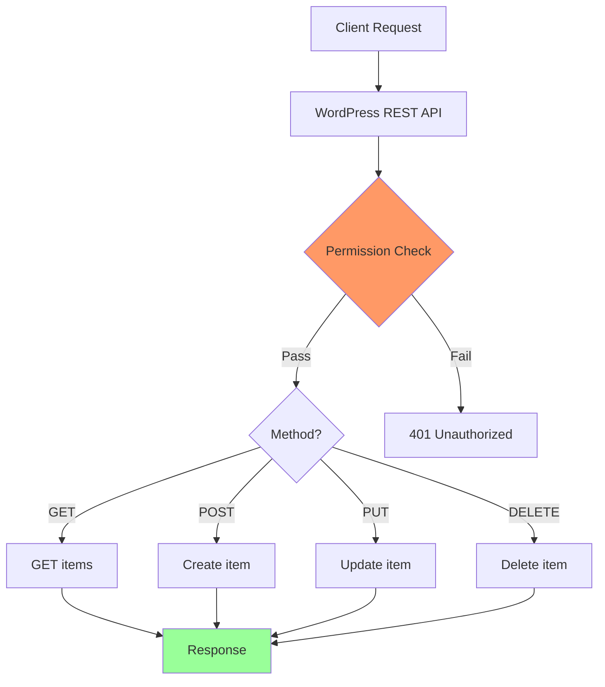

# wp-rest-api: Ultimate WordPress REST API Skill

## Purpose

This skill provides comprehensive guidance for developing WordPress REST API endpoints with full CRUD operations, custom controllers, authentication, and proper security.

## Trigger

- **Manual:** `/wp-rest-api` or "REST API" or "API Endpoint"
- **From wordpress super-skill:** When user requests API development

---

## Core Responsibilities

| Responsibility | Description |
|----------------|-------------|
| **Endpoint Registration** | Create REST routes with register_rest_route |
| **CRUD Operations** | GET, POST, PUT, DELETE handlers |
| **Custom Controllers** | Extend WP_REST_Controller |
| **Schema Definition** | Define request/response schemas |
| **Authentication** | Application Passwords, OAuth, JWT |
| **Permission Callbacks** | Capability and nonce verification |
| **Pagination** | Proper pagination with links |

---

## Step 1: Endpoint Architecture

### REST API Structure



---

## Step 2: Basic Endpoint Registration

### A) Simple Endpoint (Functional Style)

```php
<?php
add_action( 'rest_api_init', function() {
    register_rest_route( 'my-plugin/v1', '/data', array(
        'methods'  => WP_REST_Server::READABLE,
        'callback' => 'get_my_plugin_data',
        'permission_callback' => function() {
            return current_user_can( 'edit_posts' );
        }
    ) );
    
    register_rest_route( 'my-plugin/v1', '/data/(?P<id>\d+)', array(
        'methods'  => WP_REST_Server::EDITABLE,
        'callback' => 'update_my_plugin_data',
        'permission_callback' => function() {
            return current_user_can( 'edit_posts' );
        },
        'args' => array(
            'id' => array(
                'validate_callback' => function( $param ) {
                    return is_numeric( $param );
                }
            ),
            'title' => array(
                'sanitize_callback' => 'sanitize_text_field'
            ),
            'content' => array(
                'sanitize_callback' => 'wp_kses_post'
            )
        )
    ) );
} );

function get_my_plugin_data( WP_REST_Request $request ) {
    $data = get_option( 'my_plugin_data', array() );
    return rest_ensure_response( $data );
}

function update_my_plugin_data( WP_REST_Request $request ) {
    $id   = $request->get_param( 'id' );
    $title = $request->get_param( 'title' );
    $content = $request->get_param( 'content' );
    
    $item = array(
        'id'      => $id,
        'title'   => sanitize_text_field( $title ),
        'content' => wp_kses_post( $content ),
        'updated' => current_time( 'mysql' )
    );
    
    update_option( 'my_plugin_data_' . $id, $item );
    
    return rest_ensure_response( $item );
}
```

### B) Controller-Based (Object-Oriented)

```php
<?php
namespace MyVendor\MyPlugin\REST;

use WP_REST_Controller;
use WP_REST_Server;
use WP_Error;

class Data_Controller extends WP_REST_Controller {
    
    protected $namespace = 'my-plugin/v1';
    protected $rest_base = 'data';
    
    public function __construct() {
        add_action( 'rest_api_init', array( $this, 'register_routes' ) );
    }
    
    public function register_routes() {
        register_rest_route( 
            $this->namespace, 
            '/' . $this->rest_base,
            array(
                array(
                    'methods'             => WP_REST_Server::READABLE,
                    'callback'            => array( $this, 'get_items' ),
                    'permission_callback' => array( $this, 'get_items_permissions_check' ),
                    'args'                => $this->get_collection_params()
                ),
                array(
                    'methods'             => WP_REST_Server::CREATABLE,
                    'callback'            => array( $this, 'create_item' ),
                    'permission_callback' => array( $this, 'create_item_permissions_check' ),
                    'args'                => array_merge(
                        $this->get_endpoint_args_for_item_schema( WP_REST_Server::CREATABLE ),
                        array(
                            'title' => array(
                                'type'        => 'string',
                                'description' => __( 'The title for the item.', 'my-plugin' ),
                                'required'    => true
                            )
                        )
                    )
                )
            )
        );
        
        register_rest_route(
            $this->namespace,
            '/' . $this->rest_base . '/(?P<id>\d+)',
            array(
                'methods'             => WP_REST_Server::READABLE,
                'callback'            => array( $this, 'get_item' ),
                'permission_callback' => array( $this, 'get_item_permissions_check' ),
                'args'                => array(
                    'id' => array(
                        'validate_callback' => function( $param ) {
                            return is_numeric( $param );
                        }
                    )
                )
            )
        );
        
        register_rest_route(
            $this->namespace,
            '/' . $this->rest_base . '/(?P<id>\d+)',
            array(
                'methods'             => WP_REST_Server::EDITABLE,
                'callback'            => array( $this, 'update_item' ),
                'permission_callback' => array( $this, 'update_item_permissions_check' ),
                'args'                => $this->get_endpoint_args_for_item_schema( WP_REST_Server::EDITABLE )
            )
        );
        
        register_rest_route(
            $this->namespace,
            '/' . $this->rest_base . '/(?P<id>\d+)',
            array(
                'methods'             => WP_REST_Server::DELETABLE,
                'callback'            => array( $this, 'delete_item' ),
                'permission_callback' => array( $this, 'delete_item_permissions_check' ),
                'args'                => array(
                    'id' => array(
                        'validate_callback' => function( $param ) {
                            return is_numeric( $param );
                        }
                    )
                )
            )
        );
    }
    
    public function get_items( $request ) {
        $items = $this->get_items_from_database();
        
        $data = array();
        foreach ( $items as $item ) {
            $data[] = $this->prepare_item_for_response( $item, $request );
        }
        
        $response = rest_ensure_response( $data );
        
        // Add pagination headers
        $response->header( 'X-WP-Total', count( $items ) );
        
        return $response;
    }
    
    public function get_item( $request ) {
        $id   = (int) $request['id'];
        $item = $this->get_item_from_database( $id );
        
        if ( ! $item ) {
            return new WP_Error( 
                'rest_item_not_found',
                __( 'Item not found.', 'my-plugin' ),
                array( 'status' => 404 )
            );
        }
        
        return $this->prepare_item_for_response( $item, $request );
    }
    
    public function create_item( $request ) {
        $item = $this->prepare_item_for_database( $request );
        $id   = $this->save_item_to_database( $item );
        
        if ( is_wp_error( $id ) ) {
            return $id;
        }
        
        $item = $this->get_item_from_database( $id );
        $response = $this->prepare_item_for_response( $item, $request );
        $response->set_status( 201 );
        
        return $response;
    }
    
    public function update_item( $request ) {
        $id = (int) $request['id'];
        
        $item = $this->get_item_from_database( $id );
        if ( ! $item ) {
            return new WP_Error(
                'rest_item_not_found',
                __( 'Item not found.', 'my-plugin' ),
                array( 'status' => 404 )
            );
        }
        
        $updated_item = $this->prepare_item_for_database( $request, $id );
        $this->update_item_in_database( $updated_item );
        
        $item = $this->get_item_from_database( $id );
        return $this->prepare_item_for_response( $item, $request );
    }
    
    public function delete_item( $request ) {
        $id = (int) $request['id'];
        
        $item = $this->get_item_from_database( $id );
        if ( ! $item ) {
            return new WP_Error(
                'rest_item_not_found',
                __( 'Item not found.', 'my-plugin' ),
                array( 'status' => 404 )
            );
        }
        
        $this->delete_item_from_database( $id );
        
        return rest_ensure_response( array(
            'deleted'  => true,
            'previous' => $item
        ) );
    }
    
    public function get_items_permissions_check( $request ) {
        return current_user_can( 'edit_posts' );
    }
    
    public function get_item_permissions_check( $request ) {
        return $this->get_items_permissions_check( $request );
    }
    
    public function create_item_permissions_check( $request ) {
        return current_user_can( 'edit_posts' );
    }
    
    public function update_item_permissions_check( $request ) {
        return current_user_can( 'edit_posts' );
    }
    
    public function delete_item_permissions_check( $request ) {
        return current_user_can( 'delete_posts' );
    }
    
    public function get_item_schema() {
        return array(
            '$schema'    => 'http://json-schema.org/draft-04/schema#',
            'title'     => 'my_plugin_item',
            'type'      => 'object',
            'properties' => array(
                'id' => array(
                    'type'        => 'integer',
                    'description' => __( 'Unique identifier for the object.', 'my-plugin' ),
                    'context'     => array( 'view', 'edit', 'embed' ),
                    'readonly'    => true
                ),
                'title' => array(
                    'type'        => 'string',
                    'description' => __( 'The title for the object.', 'my-plugin' ),
                    'context'     => array( 'view', 'edit' )
                ),
                'content' => array(
                    'type'        => 'string',
                    'description' => __( 'The content for the object.', 'my-plugin' ),
                    'context'     => array( 'view', 'edit' )
                ),
                'status' => array(
                    'type'        => 'string',
                    'enum'        => array( 'draft', 'publish' ),
                    'description' => __( 'A named status for the object.', 'my-plugin' ),
                    'context'     => array( 'view', 'edit' ),
                    'default'     => 'draft'
                ),
                'created' => array(
                    'type'        => 'string',
                    'format'      => 'date-time',
                    'description' => __( 'The date the object was created.', 'my-plugin' ),
                    'context'     => array( 'view', 'edit' ),
                    'readonly'    => true
                ),
                'updated' => array(
                    'type'        => 'string',
                    'format'      => 'date-time',
                    'description' => __( 'The date the object was last modified.', 'my-plugin' ),
                    'context'     => array( 'view', 'edit' ),
                    'readonly'    => true
                )
            )
        );
    }
    
    public function get_collection_params() {
        return array(
            'page' => array(
                'description'       => __( 'Current page of the collection.', 'my-plugin' ),
                'type'              => 'integer',
                'default'           => 1,
                'validate_callback' => function( $param ) {
                    return is_numeric( $param );
                }
            ),
            'per_page' => array(
                'description'       => __( 'Maximum number of items to be returned in result set.', 'my-plugin' ),
                'type'              => 'integer',
                'default'           => 10,
                'minimum'           => 1,
                'maximum'           => 100,
                'validate_callback' => function( $param ) {
                    return is_numeric( $param );
                }
            ),
            'search' => array(
                'description'       => __( 'Limit results to those matching a string.', 'my-plugin' ),
                'type'              => 'string',
                'validate_callback' => function( $param ) {
                    return is_string( $param );
                }
            )
        );
    }
    
    protected function prepare_item_for_response( $item, $request ) {
        $data = array(
            'id'       => $item->id,
            'title'    => $item->title,
            'content'  => $item->content,
            'status'   => $item->status,
            'created'  => mysql_to_rfc3339( $item->created ),
            'updated'  => mysql_to_rfc3339( $item->updated )
        );
        
        $response = rest_ensure_response( $data );
        
        // Add links
        $response->add_link( 
            'self', 
            rest_url( "/{$this->namespace}/{$this->rest_base}/{$item->id}" )
        );
        
        return $response;
    }
    
    protected function prepare_item_for_database( $request, $id = null ) {
        return array(
            'title'   => sanitize_text_field( $request->get_param( 'title' ) ),
            'content' => wp_kses_post( $request->get_param( 'content' ) ),
            'status'  => sanitize_key( $request->get_param( 'status' ) ),
            'id'      => $id
        );
    }
    
    protected function get_items_from_database() {
        global $wpdb;
        $table = $wpdb->prefix . 'my_plugin_items';
        
        return $wpdb->get_results( "SELECT * FROM {$table} ORDER BY id DESC" );
    }
    
    protected function get_item_from_database( $id ) {
        global $wpdb;
        $table = $wpdb->prefix . 'my_plugin_items';
        
        return $wpdb->get_row( $wpdb->prepare( "SELECT * FROM {$table} WHERE id = %d", $id ) );
    }
    
    protected function save_item_to_database( $item ) {
        global $wpdb;
        $table = $wpdb->prefix . 'my_plugin_items';
        
        $result = $wpdb->insert( $table, array(
            'title'   => $item['title'],
            'content' => $item['content'],
            'status'  => $item['status'],
            'created' => current_time( 'mysql' ),
            'updated' => current_time( 'mysql' )
        ) );
        
        return $result ? $wpdb->insert_id : false;
    }
    
    protected function update_item_in_database( $item ) {
        global $wpdb;
        $table = $wpdb->prefix . 'my_plugin_items';
        
        return $wpdb->update( 
            $table,
            array(
                'title'   => $item['title'],
                'content' => $item['content'],
                'status'  => $item['status'],
                'updated' => current_time( 'mysql' )
            ),
            array( 'id' => $item['id'] )
        );
    }
    
    protected function delete_item_from_database( $id ) {
        global $wpdb;
        $table = $wpdb->prefix . 'my_plugin_items';
        
        return $wpdb->delete( $table, array( 'id' => $id ) );
    }
}
```

---

## Step 3: Schema Definition

### Response Schema

```php
public function get_item_schema() {
    return array(
        '$schema'    => 'http://json-schema.org/draft-04/schema#',
        'title'     => 'book',
        'type'      => 'object',
        'properties' => array(
            'id' => array(
                'type'        => 'integer',
                'description' => __( 'Unique identifier for the book.', 'my-plugin' ),
                'context'     => array( 'view', 'edit', 'embed' ),
                'readonly'    => true
            ),
            'title' => array(
                'type'        => 'string',
                'description' => __( 'The book title.', 'my-plugin' ),
                'context'     => array( 'view', 'edit' ),
                'arg_options' => array(
                    'sanitize_callback' => 'sanitize_text_field'
                )
            ),
            'author' => array(
                'type'        => 'integer',
                'description' => __( 'The author ID.', 'my-plugin' ),
                'context'     => array( 'view', 'edit' )
            ),
            'isbn' => array(
                'type'        => 'string',
                'pattern'     => '^[0-9]{13}$',
                'description' => __( 'ISBN-13 number.', 'my-plugin' ),
                'context'     => array( 'view', 'edit' )
            ),
            'published_date' => array(
                'type'        => 'string',
                'format'      => 'date',
                'description' => __( 'Publication date.', 'my-plugin' ),
                'context'     => array( 'view', 'edit' )
            ),
            'meta' => array(
                'type'        => 'object',
                'description' => __( 'Additional metadata.', 'my-plugin' ),
                'context'     => array( 'view', 'edit' ),
                'properties'  => array(
                    'rating' => array(
                        'type' => 'integer',
                        'minimum' => 1,
                        'maximum' => 5
                    ),
                    'review' => array(
                        'type' => 'string'
                    )
                )
            )
        )
    );
}
```

---

## Step 4: Authentication

### A) Application Passwords

```php
// Register route with application password support
register_rest_route( 'my-plugin/v1', '/protected', array(
    'methods'             => WP_REST_Server::READABLE,
    'callback'            => array( $this, 'get_protected_data' ),
    'permission_callback' => function( $request ) {
        // Check if user is authenticated
        $user = wp_get_current_user();
        
        // Application passwords set user->ID but with limited capabilities
        // Use application_passwords_user_has_usable_password() to check
        
        return current_user_can( 'edit_posts' );
    }
) );

// Get user from application password
add_filter( 'application_passwords_authenticate', function( $user, $password ) {
    // Custom validation if needed
    return $user;
}, 10, 2 );
```

### B) Custom Authentication

```php
class Custom_Auth extends WP_REST_Controller {
    
    public function register_routes() {
        register_rest_route( 'my-plugin/v1', '/secure', array(
            'methods'             => WP_REST_Server::READABLE,
            'callback'            => array( $this, 'get_secure_data' ),
            'permission_callback' => array( $this, 'custom_auth_check' )
        ) );
    }
    
    public function custom_auth_check( $request ) {
        $auth_header = $request->get_header( 'Authorization' );
        
        if ( ! $auth_header ) {
            return new WP_Error(
                'rest_no_auth',
                __( 'Authentication required.', 'my-plugin' ),
                array( 'status' => 401 )
            );
        }
        
        // Parse: Bearer <token>
        $parts = explode( ' ', $auth_header );
        
        if ( count( $parts ) !== 2 || $parts[0] !== 'Bearer' ) {
            return new WP_Error(
                'rest_invalid_auth',
                __( 'Invalid authentication header.', 'my-plugin' ),
                array( 'status' => 401 )
            );
        }
        
        $token = $parts[1];
        
        // Validate token (e.g., JWT, custom token)
        $user = $this->validate_token( $token );
        
        if ( is_wp_error( $user ) ) {
            return $user;
        }
        
        // Set current user
        wp_set_current_user( $user->ID );
        
        return true;
    }
    
    protected function validate_token( $token ) {
        // Implement token validation logic
        // Return WP_Error on failure, WP_User on success
        
        $transient_key = 'auth_token_' . md5( $token );
        $user_id = get_transient( $transient_key );
        
        if ( ! $user_id ) {
            return new WP_Error(
                'rest_invalid_token',
                __( 'Invalid or expired token.', 'my-plugin' ),
                array( 'status' => 401 )
            );
        }
        
        return get_userdata( $user_id );
    }
}
```

---

## Step 5: Advanced Features

### A) Pagination

```php
public function get_items( $request ) {
    $per_page = $request->get_param( 'per_page' );
    $page     = $request->get_param( 'page' );
    
    $per_page = $per_page ? (int) $per_page : 10;
    $page     = $page ? (int) $page : 1;
    
    $offset   = ( $page - 1 ) * $per_page;
    
    global $wpdb;
    $table = $wpdb->prefix . 'my_plugin_items';
    
    $total = $wpdb->get_var( "SELECT COUNT(*) FROM {$table}" );
    $items = $wpdb->get_results( 
        $wpdb->prepare( 
            "SELECT * FROM {$table} LIMIT %d OFFSET %d", 
            $per_page, 
            $offset 
        ) 
    );
    
    $data = array();
    foreach ( $items as $item ) {
        $data[] = $this->prepare_item_for_response( $item, $request );
    }
    
    $response = rest_ensure_response( $data );
    
    // Pagination headers
    $response->header( 'X-WP-Total', (int) $total );
    $response->header( 'X-WP-TotalPages', ceil( $total / $per_page ) );
    
    // Add pagination links
    $base = rest_url( $this->namespace . '/' . $this->rest_base );
    
    if ( $page > 1 ) {
        $response->add_link( 'prev', add_query_arg( 'page', $page - 1, $base ) );
    }
    
    if ( $page < ceil( $total / $per_page ) ) {
        $response->add_link( 'next', add_query_arg( 'page', $page + 1, $base ) );
    }
    
    return $response;
}
```

### B) Filtering

```php
public function get_items( $request ) {
    $args = array(
        'post_status' => $request->get_param( 'status' ),
        'posts_per_page' => $request->get_param( 'per_page' ) ?: 10,
        'paged' => $request->get_param( 'page' ) ?: 1,
        's' => $request->get_param( 'search' )
    );
    
    // Handle custom taxonomy filtering
    $category = $request->get_param( 'category' );
    if ( $category ) {
        $args['tax_query'] = array(
            array(
                'taxonomy' => 'category',
                'field'    => 'term_id',
                'terms'    => $category
            )
        );
    }
    
    $query = new WP_Query( $args );
    
    $data = array();
    foreach ( $query->posts as $post ) {
        $data[] = $this->prepare_item_for_response( $post, $request );
    }
    
    $response = rest_ensure_response( $data );
    $response->header( 'X-WP-Total', $query->found_posts );
    $response->header( 'X-WP-TotalPages', $query->max_num_pages );
    
    return $response;
}
```

### C) Field Filtering

```php
public function get_item( $request ) {
    $item = $this->get_item_from_database( $request['id'] );
    
    $data = array(
        'id'       => $item->id,
        'title'    => $item->title,
        'content'  => $item->content
    );
    
    // Support _fields parameter
    $fields = $request->get_param( '_fields' );
    if ( $fields ) {
        $requested_fields = array_flip( explode( ',', $fields ) );
        $data = array_intersect_key( $data, $requested_fields );
    }
    
    return rest_ensure_response( $data );
}
```

---

## Step 6: Error Handling

### Error Response Patterns

```php
// 400 Bad Request
return new WP_Error(
    'rest_invalid_param',
    __( 'Invalid parameter: title is required.', 'my-plugin' ),
    array( 'status' => 400 )
);

// 401 Unauthorized
return new WP_Error(
    'rest_unauthorized',
    __( 'Authentication required.', 'my-plugin' ),
    array( 'status' => 401 )
);

// 403 Forbidden
return new WP_Error(
    'rest_forbidden',
    __( 'You do not have permission to perform this action.', 'my-plugin' ),
    array( 'status' => 403 )
);

// 404 Not Found
return new WP_Error(
    'rest_item_not_found',
    __( 'The requested item does not exist.', 'my-plugin' ),
    array( 'status' => 404 )
);

// 500 Server Error
return new WP_Error(
    'rest_internal_error',
    __( 'An error occurred while processing your request.', 'my-plugin' ),
    array( 'status' => 500 )
);
```

---

## Step 7: Testing

### PHPUnit Tests

```php
class REST_API_Test extends WP_UnitTestCase {
    
    protected $endpoint = '/wp/v2/posts';
    
    public function test_get_items() {
        $request = new WP_REST_Request( 'GET', $this->endpoint );
        $response = rest_get_server()->dispatch( $request );
        
        $this->assertEquals( 200, $response->get_status() );
    }
    
    public function test_create_item() {
        $request = new WP_REST_Request( 'POST', $this->endpoint );
        $request->set_body_params( array(
            'title'   => 'Test Post',
            'content' => 'Test content',
            'status'  => 'draft'
        ) );
        
        // Set current user with capability
        $user = $this->factory->user->create_and_get();
        wp_set_current_user( $user );
        
        $response = rest_get_server()->dispatch( $request );
        
        $this->assertEquals( 201, $response->get_status() );
        
        $data = $response->get_data();
        $this->assertEquals( 'Test Post', $data['title']['raw'] );
    }
    
    public function test_unauthorized_access() {
        wp_set_current_user( 0 );
        
        $request = new WP_REST_Request( 'POST', $this->endpoint );
        $request->set_body_params( array(
            'title' => 'Test'
        ) );
        
        $response = rest_get_server()->dispatch( $request );
        
        $this->assertEquals( 401, $response->get_status() );
    }
}
```

---

## Commands

| Command | Description |
|---------|-------------|
| `/wp-rest-api` | Start REST API workflow |
| `/wp-rest-api create [name]` | Create new endpoint |
| `/wp-rest-api crud` | Add CRUD operations |
| `/wp-rest-api auth` | Setup authentication |
| `/wp-rest-api test` | Run API tests |

---

## References

### Official Documentation

- [REST API Handbook](https://developer.wordpress.org/rest-api/)
- [REST API Reference](https://developer.wordpress.org/rest-api/reference/)
- [REST API Extending](https://developer.wordpress.org/rest-api/extending-the-rest-api/)

### Best Practices

1. **Always use permission_callback** for security
2. **Define schemas** for documentation and validation
3. **Implement pagination** for large datasets
4. **Use proper HTTP methods** (GET, POST, PUT, DELETE)
5. **Add appropriate status codes** (200, 201, 400, 401, 404)
6. **Sanitize all inputs** before database operations
7. **Add pagination headers** (X-WP-Total, X-WP-TotalPages)

---

## Version

**Version:** 1.0.0  
**Last Updated:** 2026-03-24