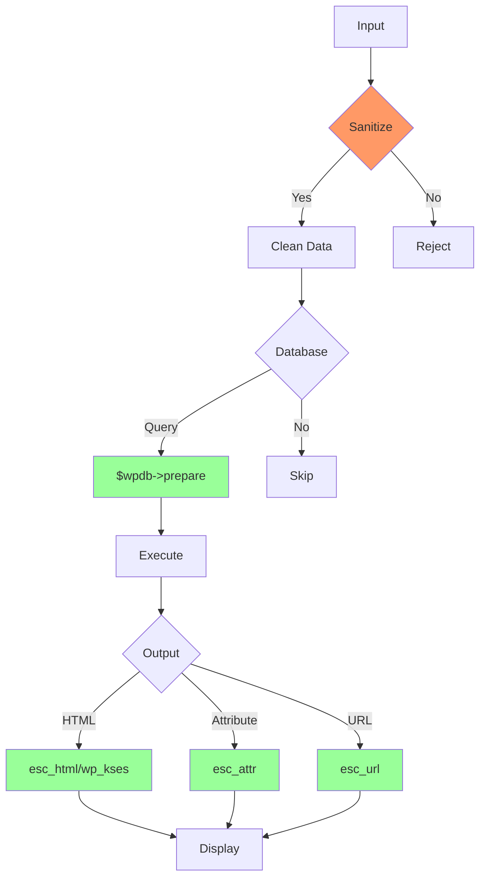

# wp-security: Ultimate WordPress Security Skill

## Purpose

This skill provides comprehensive guidance for securing WordPress plugins with proper nonces, capabilities, sanitization, escaping, and SQL injection prevention.

## Trigger

- **Manual:** `/wp-security` or "Security" or "Hardening" or "nonce"
- **From wordpress super-skill:** After testing for security audit

---

## Core Responsibilities

| Responsibility | Description |
|----------------|-------------|
| **Nonces** | Create and verify nonces |
| **Capabilities** | Role-based access control |
| **Input Sanitization** | Clean all user inputs |
| **Output Escaping** | Escape all outputs |
| **SQL Prevention** | Prevent SQL injection |
| **CSRF Protection** | Cross-site request forgery |
| **XSS Prevention** | Cross-site scripting |

---

## Step 1: Nonce Lifecycle

### A) Creating Nonces

```php
<?php
// Form nonce (for POST requests)
$nonce = wp_create_nonce( 'my_plugin_action' );
// Generates: a1b2c3d4e5f6...

// Verify nonce
if ( ! isset( $_POST['_wpnonce'] ) || ! wp_verify_nonce( $_POST['_wpnonce'], 'my_plugin_action' ) ) {
    wp_die( __( 'Security check failed', 'my-plugin' ) );
}

// Ajax nonce (for AJAX requests)
$ajax_nonce = wp_create_nonce( 'my_plugin_ajax' );

// URL nonce (for GET requests)
$url = admin_url( 'admin-post.php?action=my_action&_wpnonce=' . wp_create_nonce( 'my_plugin_url' ) );

// Custom action nonce
$nonce = wp_create_nonce( 'my_plugin_custom_action' );
```

### B) Ajax Nonce Implementation

```php
<?php
// Enqueue script with nonce
function enqueue_admin_scripts() {
    wp_enqueue_script( 'my-plugin-admin', plugins_url( 'js/admin.js', __FILE__ ), array( 'jquery' ), '1.0', true );
    
    wp_localize_script( 'my-plugin-admin', 'myPluginData', array(
        'ajax_url' => admin_url( 'admin-ajax.php' ),
        'nonce'    => wp_create_nonce( 'my_plugin_ajax' ),
        'i18n'     => array(
            'save_success' => __( 'Saved successfully', 'my-plugin' ),
            'save_error'   => __( 'Error saving', 'my-plugin' )
        )
    ) );
}
add_action( 'admin_enqueue_scripts', 'enqueue_admin_scripts' );

// AJAX handler - Save
add_action( 'wp_ajax_my_plugin_save', 'handle_ajax_save' );
function handle_ajax_save() {
    // Verify nonce
    if ( ! check_ajax_referer( 'my_plugin_ajax', 'nonce', false ) ) {
        wp_send_json_error( array( 'message' => __( 'Invalid nonce', 'my-plugin' ) ), 403 );
    }
    
    // Verify capability
    if ( ! current_user_can( 'manage_options' ) ) {
        wp_send_json_error( array( 'message' => __( 'Unauthorized', 'my-plugin' ) ), 403 );
    }
    
    // Process data
    $data = isset( $_POST['data'] ) ? sanitize_text_field( $_POST['data'] ) : '';
    
    // Save
    update_option( 'my_plugin_data', $data );
    
    wp_send_json_success( array( 'message' => __( 'Saved', 'my-plugin' ) ) );
}
```

### C) Form Nonce Implementation

```php
<?php
// Display form with nonce
function render_settings_form() {
    ?>
    <form method="post" action="<?php echo esc_url( admin_url( 'admin-post.php' ) ); ?>">
        <?php wp_nonce_field( 'my_plugin_settings', '_wpnonce' ); ?>
        <input type="hidden" name="action" value="my_plugin_save_settings">
        
        <label>
            <?php esc_html_e( 'Setting Name', 'my-plugin' ); ?>
            <input type="text" name="setting_name" value="">
        </label>
        
        <?php submit_button( __( 'Save', 'my-plugin' ) ); ?>
    </form>
    <?php
}

// Handle form submission
add_action( 'admin_post_my_plugin_save_settings', 'handle_settings_save' );
function handle_settings_save() {
    // Verify nonce
    if ( ! isset( $_POST['_wpnonce'] ) || ! wp_verify_nonce( $_POST['_wpnonce'], 'my_plugin_settings' ) ) {
        wp_die( __( 'Security check failed', 'my-plugin' ) );
    }
    
    // Verify capability
    if ( ! current_user_can( 'manage_options' ) ) {
        wp_die( __( 'Unauthorized', 'my-plugin' ) );
    }
    
    // Process and redirect
    if ( isset( $_POST['setting_name'] ) ) {
        update_option( 'my_plugin_setting', sanitize_text_field( $_POST['setting_name'] ) );
    }
    
    wp_redirect( add_query_arg( 'message', 'saved', wp_get_referer() ) );
    exit;
}
```

---

## Step 2: Capabilities

### A) Capability Checks

```php
<?php
// Basic capability check
if ( ! current_user_can( 'manage_options' ) ) {
    wp_die( __( 'Unauthorized', 'my-plugin' ) );
}

// For custom post types
if ( ! current_user_can( 'edit_post', $post_id ) ) {
    wp_die( __( 'You cannot edit this post', 'my-plugin' ) );
}

// For custom capabilities
if ( ! current_user_can( 'my_plugin_manage' ) ) {
    wp_die( __( 'Access denied', 'my-plugin' ) );
}

// Check multiple capabilities
if ( ! current_user_can( 'edit_posts' ) || ! current_user_can( 'edit_others_posts' ) ) {
    wp_die( __( 'Insufficient permissions', 'my-plugin' ) );
}

// Custom capability definitions
function add_custom_capabilities() {
    $role = get_role( 'administrator' );
    if ( $role ) {
        $role->add_cap( 'my_plugin_manage' );
        $role->add_cap( 'my_plugin_view' );
        $role->add_cap( 'my_plugin_edit' );
    }
}
register_activation_hook( __FILE__, 'add_custom_capabilities' );
```

### B) REST API Capabilities

```php
<?php
// REST API permission callback
register_rest_route( 'my-plugin/v1', '/data', array(
    'methods'             => WP_REST_Server::READABLE,
    'callback'            => 'get_data',
    'permission_callback' => function( $request ) {
        // Option 1: Check specific capability
        return current_user_can( 'edit_posts' );
        
        // Option 2: Check for specific post
        $post_id = $request->get_param( 'id' );
        if ( $post_id ) {
            return current_user_can( 'edit_post', $post_id );
        }
        
        // Option 3: Check application password
        $user = wp_get_current_user();
        return $user && $user->ID > 0;
    }
) );

// Role-based access
function check_custom_cap( $allowed, $request ) {
    $capability = $request->get_param( 'capability' );
    
    if ( $capability && ! current_user_can( $capability ) ) {
        return false;
    }
    
    return true;
}
```

---

## Step 3: Input Sanitization

### A) Common Sanitization Functions

```php
<?php
// Text fields
$text = sanitize_text_field( $_POST['text_input'] );
$textarea = sanitize_textarea_field( $_POST['textarea'] );
$key = sanitize_key( $_POST['key_input'] );

// Email
$email = sanitize_email( 'test@example.com' );
if ( ! is_email( $email ) ) {
    // Invalid
}

// URLs
$url = esc_url_raw( $user_input );
$url = esc_url( $user_input );

// HTML/Mixed content
$html = wp_kses_post( $user_html ); // Allows safe HTML
$html = wp_kses( $user_html, $allowed_html );

// File names
$filename = sanitize_file_name( $filename );

// Titles
$title = sanitize_title( $title );
$title = sanitize_title_for_query( $title );

// SQL identifiers (table/column names)
$orderby = sanitize_key( $_GET['orderby'] ); // Use whitelist
$order = in_array( $_GET['order'], array( 'ASC', 'DESC' ) ) ? $_GET['order'] : 'ASC';

// Custom sanitization
function sanitize_custom_data( $data ) {
    return array_map( function( $item ) {
        return array(
            'title'   => sanitize_text_field( $item['title'] ),
            'content' => wp_kses_post( $item['content'] ),
            'order'   => absint( $item['order'] ),
            'enabled' => ! empty( $item['enabled'] )
        );
    }, $data );
}
```

### B) Sanitization in REST API

```php
<?php
register_rest_route( 'my-plugin/v1', '/items', array(
    'methods'             => WP_REST_Server::CREATABLE,
    'callback'            => 'create_item',
    'permission_callback' => 'custom_cap_check',
    'args'                => array(
        'title' => array(
            'type'              => 'string',
            'required'          => true,
            'sanitize_callback' => 'sanitize_text_field'
        ),
        'content' => array(
            'type'              => 'string',
            'sanitize_callback' => 'wp_kses_post'
        ),
        'status' => array(
            'type'              => 'string',
            'enum'              => array( 'draft', 'publish' ),
            'sanitize_callback' => function( $param ) {
                return in_array( $param, array( 'draft', 'publish' ) ) ? $param : 'draft';
            }
        ),
        'email' => array(
            'type'              => 'string',
            'sanitize_callback' => 'sanitize_email'
        ),
        'url' => array(
            'type'              => 'string',
            'sanitize_callback' => 'esc_url_raw'
        ),
        'number' => array(
            'type'              => 'integer',
            'sanitize_callback' => 'absint'
        )
    )
) );
```

---

## Step 4: Output Escaping

### A) Escaping Functions

```php
<?php
// HTML content
echo esc_html( $text );
echo esc_html_e( $text, 'my-plugin' ); // Echo with text domain

// HTML attributes
echo esc_attr( $attribute );
echo esc_attr_e( $attribute, 'my-plugin' );

// URLs
echo esc_url( $url );
echo esc_url_raw( $url ); // For database/storage
echo esc_html( esc_url( $url ) ); // Display with fallback

// JavaScript
echo esc_js( $js_string );
wp_enqueue_script( 'my-script', ..., array(), '1.0', true );

// Textarea content
echo esc_textarea( $textarea );

// HTML allowed (with filters)
echo wp_kses_post( $html );
echo wp_kses( $html, $allowed_html );

// JSON
echo wp_json_encode( $data );
wp_send_json( $response ); // Automatically escapes

// SQL (for display, not queries!)
// Use $wpdb->prepare for queries, NOT for display
```

### B) Escaping in Templates

```php
<?php
// In PHP templates
?>
<h1><?php echo esc_html( $title ); ?></h1>
<p><?php echo esc_html( $author ); ?></p>
<div class="content"><?php echo wp_kses_post( $content ); ?></div>
<a href="<?php echo esc_url( $link ); ?>"><?php echo esc_html( $link_text ); ?></a>
" alt="<?php echo esc_attr( $alt_text ); ?>">
<input type="text" value="<?php echo esc_attr( $value ); ?>">

<?php
// In JavaScript (data attributes)
$json_data = array(
    'ajax_url' => admin_url( 'admin-ajax.php' ),
    'nonce'    => wp_create_nonce( 'my_plugin' ),
    'i18n'     => array(
        'save' => __( 'Save', 'my-plugin' )
    )
);
?>
<script>
var myPluginData = <?php echo wp_json_encode( $json_data ); ?>;
</script>
```

---

## Step 5: SQL Injection Prevention

### A) Using $wpdb->prepare

```php
<?php
global $wpdb;

// SELECT with prepare
$id = absint( $_GET['id'] );
$results = $wpdb->get_results(
    $wpdb->prepare(
        "SELECT * FROM {$wpdb->posts} WHERE ID = %d AND post_status = %s",
        $id,
        'publish'
    )
);

// INSERT with prepare
$wpdb->insert(
    $wpdb->prefix . 'my_table',
    array(
        'title'   => sanitize_text_field( $title ),
        'content' => wp_kses_post( $content )
    ),
    array( '%s', '%s' )
);

// UPDATE with prepare
$wpdb->update(
    $wpdb->prefix . 'my_table',
    array( 'title' => sanitize_text_field( $title ) ),
    array( 'id' => absint( $id ) ),
    array( '%s' ),
    array( '%d' )
);

// DELETE with prepare
$wpdb->delete(
    $wpdb->prefix . 'my_table',
    array( 'id' => absint( $id ) ),
    array( '%d' )
);

// Complex query
$search = '%' . $wpdb->esc_like( sanitize_text_field( $_GET['search'] ) ) . '%';
$results = $wpdb->get_results(
    $wpdb->prepare(
        "SELECT * FROM {$wpdb->posts} 
         WHERE post_title LIKE %s 
         AND post_type = %s 
         ORDER BY post_date DESC 
         LIMIT %d",
        $search,
        'book',
        10
    )
);
```

### B) Safe Table Names

```php
<?php
// Always use $wpdb->prefix for table names
$table_name = $wpdb->prefix . 'my_custom_table';

// In joins, use $wpdb->posts, $wpdb->users, etc.
$results = $wpdb->get_results(
    $wpdb->prepare(
        "SELECT p.*, u.display_name 
         FROM {$wpdb->posts} p 
         LEFT JOIN {$wpdb->users} u ON p.post_author = u.ID 
         WHERE p.ID = %d",
        $post_id
    )
);

// Escape LIKE patterns
$search_term = $wpdb->esc_like( $search );
$pattern = '%' . $search_term . '%';
```

---

## Step 6: Security Checklist

### Mermaid: Security Workflow



### Security Checklist

| Category | Item | Status |
|----------|------|--------|
| **Nonces** | Verify all form submissions | ☐ |
| **Nonces** | Verify all AJAX requests | ☐ |
| **Nonces** | Verify all REST API calls | ☐ |
| **Capabilities** | Check capability for admin actions | ☐ |
| **Capabilities** | Check capability for REST endpoints | ☐ |
| **Capabilities** | Check capability for meta updates | ☐ |
| **Sanitization** | Sanitize all text inputs | ☐ |
| **Sanitization** | Sanitize all HTML content | ☐ |
| **Sanitization** | Validate numeric inputs | ☐ |
| **Escaping** | Escape all HTML output | ☐ |
| **Escaping** | Escape all attributes | ☐ |
| **Escaping** | Escape all URLs | ☐ |
| **SQL** | Use $wpdb->prepare for all queries | ☐ |
| **SQL** | Use placeholder types correctly | ☐ |
| **SQL** | Validate table names | ☐ |

---

## Step 7: Security Headers

```php
<?php
// Add security headers
function add_security_headers() {
    header( 'X-Content-Type-Options: nosniff' );
    header( 'X-Frame-Options: SAMEORIGIN' );
    header( 'X-XSS-Protection: 1; mode=block' );
    
    // Content Security Policy (careful with WP)
    // header( "Content-Security-Policy: default-src 'self';" );
}
add_action( 'send_headers', 'add_security_headers' );
```

---

## Commands

| Command | Description |
|---------|-------------|
| `/wp-security` | Start security workflow |
| `/wp-security audit` | Run security audit |
| `/wp-security nonce` | Check nonce handling |
| `/wp-security capability` | Check capabilities |
| `/wp-security sanitize` | Check sanitization |
| `/wp-security escape` | Check escaping |
| `/wp-security sql` | Check SQL queries |

---

## References

### Official Documentation

- [Security Best Practices](https://developer.wordpress.org/plugins/wordpress-org/)
- [Data Validation](https://developer.wordpress.org/plugins/wordpress-org/)
- [WordPress Coding Standards - Security](https://developer.wordpress.org/coding-standards/wordpress-coding-standards/security/)

### Best Practices

1. **Never trust user input** - always sanitize
2. **Always escape output** - use esc_* functions
3. **Use $wpdb->prepare** - never concatenate SQL
4. **Check capabilities** - for every protected action
5. **Verify nonces** - for all form submissions
6. **Fail securely** - deny by default

---

## Version

**Version:** 1.0.0  
**Last Updated:** 2026-03-24